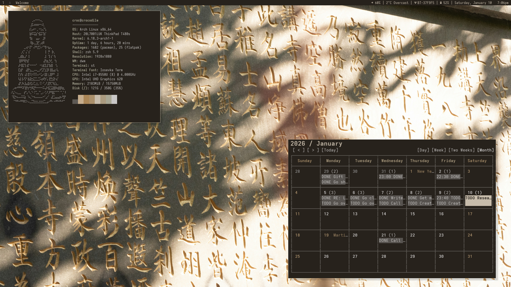
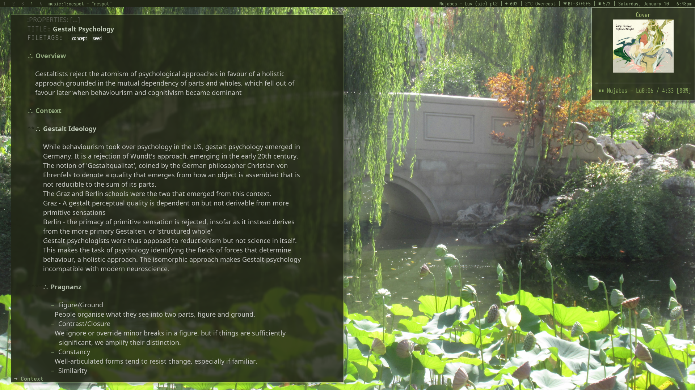

#+title: Readme

* Patches Applied

Some occasional modification here and there;

- [bartoggle keybinds](https://dwm.suckless.org/patches/bartoggle/)
- [bulkill](https://dwm.suckless.org/patches/bulkill/)
- [colorbar](https://dwm.suckless.org/patches/colorbar/)
- [fixmultimon](https://dwm.suckless.org/patches/fixmultimon/)
- [focusfullscreen](https://dwm.suckless.org/patches/focusfullscreen/)
- [focusmaster-return](https://dwm.suckless.org/patches/focusmaster/)
- [focusmonmouse](https://dwm.suckless.org/patches/focusmonmouse/)
- [hide vacant tags](https://dwm.suckless.org/patches/hide_vacant_tags/)
- [preventfocusshift](https://dwm.suckless.org/patches/preventfocusshift/)
- [restartsig](https://dwm.suckless.org/patches/restartsig/)
- [spawntag](https://dwm.suckless.org/patches/spawntag/)
- [stacker](https://dwm.suckless.org/patches/stacker/)
- [statuscmd](https://dwm.suckless.org/patches/statuscmd/)
- [sticky](https://dwm.suckless.org/patches/sticky/)
- [swallow](https://dwm.suckless.org/patches/swallow/)
- [vanitygaps](https://dwm.suckless.org/patches/vanitygaps/)
- [xrdb](https://dwm.suckless.org/patches/xrdb/)
- [scratchpad](https://dwm.suckless.org/patches/scratchpads/)

*  Basic Keybinds

All keybinds use `Mod` (Windows key) unless otherwise specified.

| Keybind                   | Action                              |
|---------------------------+-------------------------------------|
| `Mod + Enter`             | Open terminal                       |
| `Mod + p`                 | Launch dmenu                        |
| `Mod + q`                 | Kill focused window                 |
| `Mod + Shift + q`         | Kill all windows except focused     |
| `Mod + Shift + Backspace` | Exit dwm                            |
| `Mod + Ctrl + Shift + q`  | Refresh dwm (recompile and restart) |

** Navigation & Focus

| Keybind             | Action                              |
|-                    |                                     |
| `Mod + j/k`         | Focus next/previous window in stack |
| `Mod + Shift + j/k` | Move focused window in stack        |
| `Mod + Tab`         | Switch to previous tag              |
| `Mod + 1-9`         | Switch to tag N                     |
| `Mod + 0`           | View all tags                       |
| `Mod + Ctrl + 1-9`  | Toggle view of tag N                |
| `Mod + Shift + 1-9` | Move focused window to tag N        |

** Layout & Window Management

| Keybind               | Action                             |
|-                      |                                    |
| `Mod + t`             | Tiled layout                       |
| `Mod + f`             | Toggle fullscreen                  |
| `Mod + Shift + t`     | Monocle layout                     |
| `Mod + Shift + Space` | Toggle floating                    |
| `Mod + Space`         | Zoom (promote to master)           |
| `Mod + Ctrl + Space`  | Focus master                       |
| `Mod + s`             | Toggle sticky window               |
| `Mod + h/l`           | Decrease/increase master area size |
| `Mod + Shift + i`     | Increase number of master windows  |
| `Mod + Ctrl + i`      | Decrease number of master windows  |

**  Gaps Control

| Keybind           | Action                       |
|-                  |                              |
| `Mod + +/-`       | Increase/decrease all gaps   |
| `Mod + Alt + i`   | Increase/decrease inner gaps |
| `Mod + Alt + o`   | Increase/decrease outer gaps |
| `Mod + Shift + =` | Toggle gaps                  |
| `Mod + Shift + -` | Reset gaps to default        |

** Applications

| Keybind           | Action                                  |
|-------------------|-----------------------------------------|
| `Mod + m`         | Toggle music player scratchpad (ncspot) |
| `Mod + b`         | Open browser                            |
| `Mod + e`         | Open Emacs                              |
| `Mod + n`         | Open neovim (in kitty)                  |
| `Mod + Shift + f` | Open file manager (nautilus)            |
| `Mod + v`         | Open clipboard history                  |
| `Mod + Shift + w` | Wallpaper menu                          |

** Screenshots & Misc

| Keybind           | Action         |
|-------------------|----------------|
| `Mod + Shift + s` | Screenshot     |
| `Mod + Shift + r` | Screen Record  |

** Statusbar

| Keybind           | Action                |
|-                  |                       |
| `Mod + Shift + b` | Toggle bar visibility |
| `Mod + Ctrl + x`  | Refresh colors (xrdb) |
